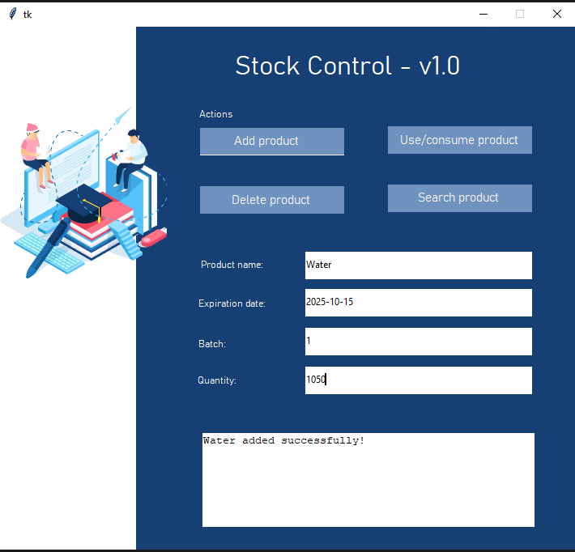

# Stock Control

In this project a stock control system was developed.

Pyodbc library was used to connect to a sqlite local database. Tkinter provides a graphical interface so users can do the operations with the stock.

## Funcionalities

- Add product 
- Search product
- Delete product
- Use/consume product

The development was done using mainly:

- Python (back-end)
- SQL (back-end)
- Tkinter (python library to do the front-end)

Main Pyhton libraries used:

- Pyodbc
- Tkinter

## Project Structure

```shell
stock-control/
├── images
│   ├── ...
├── main.py
├── stock-database.db
├── README.md
```

## Screenshots

